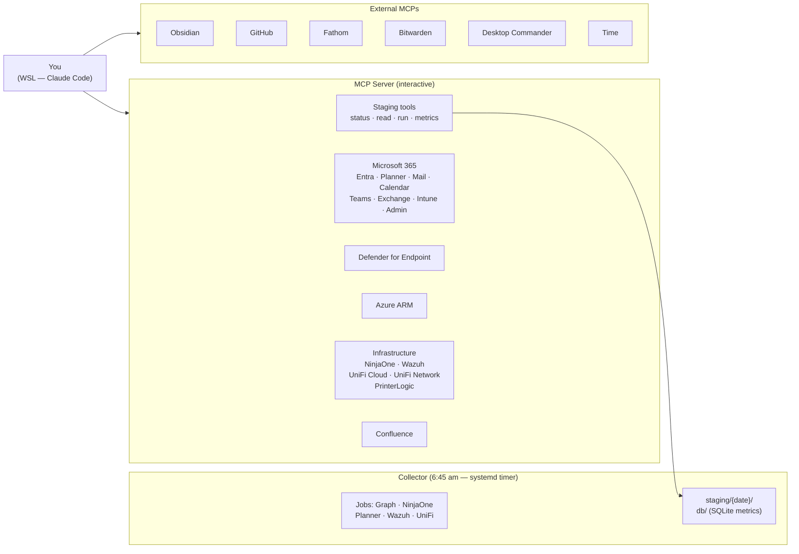

# SVH OpsMan

A purpose-built command station for SVH IT operations. Every system connected — Microsoft 365, Entra ID, Defender for Endpoint, Azure, NinjaOne, Wazuh, UniFi, PrinterLogic, Confluence. Pre-wired investigation workflows. A live status dashboard. Claude is the intelligence layer; you drive.

```
"Day starter."
"Is there anything unusual in Wazuh from last night?"
"Tell me everything about SVH-SQL01."
"Why can't users at Site B reach the file server?"
"Help me plan this month's patching."
"Prep me for my 2pm with the network vendor."
"Check if any Azure NSGs have internet-exposed ports."
```

---

## Architecture

Two services, one repo.



**Collector owns all bulk data collection.** Runs on a schedule (systemd timer, 6:45 am weekdays). Reads from `collector/.env` (credentials synced from Bitwarden via `scripts/sync-creds.sh`). Writes to `staging/{date}/` and maintains SQLite time-series metrics in `db/`. Claude never calls NinjaOne or Graph for bulk reads during a session — the collector does that before the session starts.

**MCP server owns interactive and write operations.** Connects over stdio. Reads Bitwarden credentials at startup (WSL sessions require `BW_SESSION`). Exposes staging tools so Claude can read collector output, trigger a fresh collection, and query metrics trends.

**Obsidian is home base.** Briefings, incident notes, change records, meeting notes — everything lands in Obsidian under `SVH/`. Nothing goes to Teams, Mail, Planner, or Confluence without you explicitly asking.

**Human-initiated only.** Skills are prompt patterns you trigger. Claude synthesizes — you command.

**PowerShell module suite** lives in `powershell/`. Load with `. ./connect.ps1` from Windows Terminal. Covers write operations and on-prem checks — disabling accounts, isolating devices, rebooting servers, querying Hyper-V and MABS via PSRemoting.

---

## Connected systems

> 🔒 = read-only

| System | Capability |
|--------|-----------|
| **Outlook Mail** | Search, read, send, draft — locked to your mailbox |
| **Outlook Calendar** | View events, check availability, find meeting times |
| **Teams** | Read messages, send messages, manage channels |
| **Microsoft Planner** | Plans, tasks, assignments, due dates (no deletion — complete at 100%) |
| **Microsoft To Do** | Task lists and checklist items |
| **OneDrive** | Browse, search, create folders, generate sharing links |
| **SharePoint** 🔒 | Sites, lists, pages, permissions |
| **Exchange Admin** 🔒 | Mailbox settings, domains, distribution groups, message trace |
| **Entra ID** | Users, MFA, app registrations, roles, CA policies, sign-in/audit logs, dismiss risky users |
| **Intune** 🔒 | Device compliance, configuration profiles, deployed apps |
| **MS Admin** 🔒 | Service health, active incidents, Message Center, license subscriptions |
| **Defender for Endpoint** 🔒 | Devices, alerts, incidents, software inventory, CVEs, TVM recommendations |
| **Azure** 🔒 | Resource groups, VMs, storage, VNets, NSGs, activity logs, costs, Advisor |
| **NinjaOne RMM** 🔒 | Servers and workstations — services, patches, event logs, backups, alerts |
| **Wazuh SIEM** 🔒 | Alerts, agent inventory, FIM events, vulnerability detections, rootcheck |
| **UniFi Cloud** 🔒 | Sites and devices across all locations |
| **UniFi Network** 🔒 | VLANs, WLANs, firewall rules, switch ports, connected clients |
| **PrinterLogic** 🔒 | Printers, drivers, deployment profiles, audit logs, print quotas |
| **Confluence** | Search, read, edit pages, manage comments |
| **Obsidian** | Read and write notes — home base for all output |
| **Fathom** | Meeting transcripts and summaries |
| **GitHub** | Repos, issues, PRs, Actions workflows |
| **Desktop Commander** | Run shell commands on the MCP host |
| **Bitwarden** 🔒 | Retrieve credentials; also loads MCP server credentials at startup |
| **Time** | Current time, timezone conversions, date arithmetic |

> One Graph app registration covers all Microsoft services except Defender and Azure — those each need their own. Mail and calendar tools are locked to `GRAPH_USER_ID` and cannot access any other mailbox.

---

## Skills

Trigger by slash command or by saying any of the listed phrases. Skills load on demand from `.claude/skills/` — no context cost until used. All output goes to Obsidian; nothing is sent anywhere without you explicitly asking.

### Daily rhythm

| Skill | Invoke | What it does | Output |
|-------|--------|-------------|--------|
| **Day Starter** | `/day-starter` · "Day starter" · "Morning briefing" | Checks staging freshness, reads collector output, runs real-time security queries → prioritized digest with suggested Planner updates staged for review. | `SVH/Daily/YYYY-MM-DD.md` |
| **Day Ender** | `/day-ender` · "Day ender" · "End of day" | What got done, what's open, carry-forward for tomorrow. | Appended to today's note |
| **Week Starter** | `/week-starter` · "Week starter" · "What does the week look like" | Last week's loose ends + this week's load, calendar, open tasks, suggested first move. | `SVH/Record/YYYY-WW-week-starter.md` |
| **Week Ender** | `/week-ender` · "Week ender" · "Wrap up the week" | What shipped, what slipped, seeds for next week, optional team summary draft. | `SVH/Record/YYYY-WW-week-wrap.md` |

---

### When things go wrong

| Skill | Invoke | What it does |
|-------|--------|-------------|
| **Troubleshoot** | `/troubleshoot` · "X is broken" · "Troubleshoot Y" | Systematic isolation — expected vs. actual, one user or many, ranked hypotheses, cheapest-first. References SVH failure patterns for Hyper-V, MABS, CMiC, UniFi, WSUS. |
| **Event Log Triage** | `/event-log-triage` · "Check event logs on X" · "What happened on Z around [time]" | Wazuh first for correlation, NinjaOne for gaps, Desktop Commander for PowerShell deep-dives. |
| **Event Log Analyzer** | `/event-log-analyzer` · "Analyze this event log" · "Look at the log export from X" | For exported log files (`.xml`, `.csv`, `.txt`, `.log`) rather than live queries. |
| **Network Troubleshooter** | `/network-troubleshooter` · "Network issue at [site]" · "Why can't [users] reach [resource]" | UniFi Cloud → UniFi Network (VLANs, firewall, switch ports) → Wazuh (IDS events) → NinjaOne → Desktop Commander. |
| **Mailflow Investigation** | `/mailflow-investigation` · "Did this email deliver" · "Why didn't X get my message" | Exchange message trace → Defender (attachment/URL flags) → Entra → diagnostic timeline with root cause. |
| **Tenant Forensics** | `/tenant-forensics` · "Who touched it" · "What changed before X broke" · "Forensic audit" | Azure Activity Logs + Entra Audit Logs + NinjaOne event logs merged into a single actor-grouped timeline. Flags RBAC changes, MFA resets, app consent grants, NSG edits, policy changes. |
| **IR Triage** | `/ir-triage` · alert investigation · "Is this suspicious" | **Currently disabled** (`SKILL.md.disabled`). The only skill that can send non-draft Teams messages — kept off until needed. Runs a triage gate (Burning Building / Active Investigation / Background) and enriches IOCs. |

---

### Posture & review

| Skill | Invoke | What it does | Output |
|-------|--------|-------------|--------|
| **Security Posture** | `/posture-check` · "Posture check" · "State of the land" | Green/Yellow/Red across Identity, Endpoints, Patching, Infrastructure, SIEM, and Cloud. | `SVH/Record/YYYY-MM-DD-posture.md` |
| **On-Prem Health** | `/onprem-health` · "Check the servers" · "Server health" | Staging ninja-devices + ninja-alerts + disk metrics, Desktop Commander PSRemoting checks, Hyper-V/cluster/MABS flagged separately. | `SVH/Record/YYYY-MM-DD-onprem-health.md` |
| **Vuln Triage** | `/vuln-triage` · CVE ID · Defender TVM finding | CVE → exposed devices → patch state → timeline: Emergency / This Week / Next Cycle / Accept. | `SVH/Record/CVE-YYYY-NNNNN.md` |
| **Asset Investigation** | `/asset-investigation` · "Tell me everything about [server/user]" | Servers/workstations: NinjaOne + Wazuh + Defender + Azure. Users: Entra sign-in history, MFA, roles, groups, CA policies. | `SVH/Record/YYYY-MM-DD-asset-name.md` |
| **Access Review** | `/access-review` · "Access review for [user/group/role]" | Roles, groups, app registrations, sign-ins, MFA, CA policies. Flags inactive privileged accounts, missing MFA, stale memberships. | `SVH/Record/YYYY-MM-DD-access-review.md` |
| **License Audit** | `/license-audit` · "License audit" · "License waste" | M365 licenses × Intune enrollment × MFA registration → Exposed, Ghost, Gaps. Monthly waste estimate. | `SVH/Record/YYYY-MM-DD-license-audit.md` |

---

### Planning & coordination

| Skill | Invoke | What it does | Output |
|-------|--------|-------------|--------|
| **Patch Campaign** | `/patch-campaign` · "What needs patching" · "Plan patching" | NinjaOne pending patches → Defender TVM priority → tiers (Emergency / This Week / Next Cycle / Accept) → Planner board. | `SVH/Record/YYYY-MM-DD-patch-campaign.md` |
| **Change Record** | `/change-record` · "Document this rollout" · "Change record for X" | Scope, risk, test plan, rollback, comms, schedule. Everything staged for review. | `SVH/Record/CHG-YYYY-NNN.md` |
| **Project Creator** | `/project-creator` · "Turn this into a project" | Scope, deliverables, WBS, dependencies, effort estimate. Small (≤8 items): single Planner card. Large: full Planner plan + Confluence page. | `SVH/Record/YYYY-MM-DD-project-name.md` |
| **Meeting Prep** | `/meeting-prep` · "Prep me for [meeting]" · "Pull notes from my [call]" | Before: calendar event + Fathom history + Confluence/Obsidian context + open tasks → brief + agenda template. After: Fathom transcript → structured note with decisions and suggested action items. | `SVH/Record/YYYY-MM-DD-meeting-name.md` |

---

### Content & documentation

| Skill | Invoke | What it does |
|-------|--------|-------------|
| **Draft** | `/draft` · "Draft an email" · "Write a message to" | Takes rough notes or bullet points, drafts an email or Teams message in Aaron's voice. Nothing sent — staged in Obsidian for review. |
| **TicketSmith** | `/ticketsmith` · "Write a ticket for this" · "Clean up this complaint" | Raw user complaint → professional IT ticket: title, problem, impact, steps to reproduce, suggested priority. |
| **Scribe** | `/scribe` · "Write this up" · "Document what I did" | Rough technician notes → structured documentation. Styles: standard, concise, detailed, incident-report, how-to. Optionally promotes to Confluence. |

---

## Obsidian vault

All OpsMan output lands under `SVH/` in the vault root. Everything else (Excalidraw diagrams, personal notes) remains at the vault root — OpsMan doesn't touch it.

```
OpsManVault/
  SVH/
    Inbox/      ← staged items awaiting Execute — the only folder that empties
    Daily/      ← one note per workday (Day Starter + Day Ender)
    Record/     ← everything permanent: incidents, changes, meetings, research
    System/     ← state files: briefing-state.md, cleared-items.md
    Archive/    ← manually moved when truly done
  Diagrams/     ← Excalidraw files (network topology, impact scope, WBS)
  References/   ← synced from repo references/ on every session start
```

Frontmatter on every note (required):

```yaml
---
date: YYYY-MM-DD
type: daily | incident | change | meeting | research | plan | session | draft | vuln
status: active | staged | closed | filed
tags: []
entities: []
---
```

`entities:` lists every server, site, system, or person the note concerns using consistent names (`SVH-SQL01`, `Aaron Stevens`). Dataview queries on `type` and `entities` replace folder-based navigation — no manual MOCs, no entity notes.

**Confluence holds authoritative official docs.** Obsidian is the operational intelligence layer and drafting table. When a note graduates to Confluence, it does so via Execute — never autonomously.

---

## Setup

### Requirements

| Plane | Where | What |
|-------|-------|------|
| **Interface** | WSL 2 (Ubuntu 24.04) on your workstation | Claude Code CLI, Bitwarden CLI, PowerShell 7 |
| **Service (dev)** | Same WSL instance | MCP server (stdio), collector (manual runs) |
| **Service (prod)** | Ubuntu VM on Hyper-V | MCP server + collector as systemd units |

- **Node.js** 18+
- **Bitwarden CLI** (`bw`) — unlock before every session (`export BW_SESSION=$(bw unlock --raw)`)
- Outbound HTTPS to: `graph.microsoft.com`, `login.microsoftonline.com`, `management.azure.com`, `api.securitycenter.microsoft.com`, `app.ninjarmm.com`, your UniFi controller, your Wazuh manager, `vault.bitwarden.com`

---

### 1. Install Claude Code

```bash
claude install stable
echo 'export PATH="$HOME/.local/bin:$PATH"' >> ~/.bashrc && source ~/.bashrc
which claude   # → ~/.local/bin/claude
```

---

### 2. WSL shell environment

```bash
chmod +x ~/SVH-OpsMan/scripts/wsl-shell-setup.sh
~/SVH-OpsMan/scripts/wsl-shell-setup.sh
# Then from Windows PowerShell (admin): wsl --shutdown
# Reopen terminal — systemd and zsh are now active
```

Installs: zsh, fzf, bat, eza, delta, lazygit, btop, mtr, nmap, zoxide, httpie, starship, PowerShell 7. Enables WSL systemd.

---

### 3. Project config (automatic)

The `.claude/` directory is checked into this repo. Opening the project in Claude Code automatically loads:
- **Permissions** — common git and npm operations pre-approved
- **SessionStart hook** — injects branch, dirty-file count, Bitwarden status, and ops context
- **Skills** in `.claude/skills/` — load on demand, zero context cost until triggered
- **Rules** — `typescript.md`, `obsidian-output.md`, `note-patterns.md` (always loaded)

`.claude/settings.local.json` is gitignored — use it for personal overrides.

---

### 4. Build the MCP server

```bash
cd mcp-server
npm install
npm run build
```

---

### 5. Build the collector

```bash
cd collector
npm install
```

No build step needed — collector runs via `tsx` (TypeScript execute). To run manually:

```bash
# From repo root
npx tsx collector/src/index.ts gather          # full collection
npx tsx collector/src/index.ts gather --job=ninjaone  # single job
npx tsx collector/src/index.ts watch           # update metrics DB only
```

---

### 6. Credentials

**Interactive sessions (WSL / Claude Code):** All credentials are stored in the Bitwarden vault item **SVH OpsMan**. The MCP server reads them at startup.

```bash
export BW_SESSION=$(bw unlock --raw)   # unlock vault before starting
```

**Collector / VM deployment:** The collector reads from `collector/.env`. Sync credentials from Bitwarden:

```bash
chmod +x ~/SVH-OpsMan/scripts/sync-creds.sh
~/SVH-OpsMan/scripts/sync-creds.sh   # requires BW_SESSION
# Writes collector/.env (mode 600) — never committed to git
```

Verify MCP server startup:
```
[svh-opsman] Starting — N/N service groups configured
[svh-opsman] Ready — listening on stdio
```

---

### 7. Install Tailscale

Run after the WSL restart from step 2 (systemd must be active):

```bash
~/SVH-OpsMan/scripts/tailscale-wsl-setup.sh
```

Authenticate via the URL that appears. In the Tailscale admin console, disable key expiry on this node.

For remote access to all SVH sites, deploy a UDM subnet router at each site — see `references/tailscale-udm-setup.md`.

---

### 8. Register MCPs with Claude Code

```bash
# Custom OpsMan server
claude mcp add svh-opsman -- node ~/SVH-OpsMan/mcp-server/dist/index.js

# External MCPs
claude mcp add obsidian -e OBSIDIAN_API_KEY=xxx \
  -- npx -y mcp-obsidian http://127.0.0.1:27123
  # Enable "Local REST API" plugin in Obsidian first; grab key from plugin settings

claude mcp add github -e GITHUB_PERSONAL_ACCESS_TOKEN=ghp_xxx \
  -- npx -y @modelcontextprotocol/server-github

claude mcp add fathom -e FATHOM_API_KEY=xxx \
  -- npx -y fathom-mcp

claude mcp add firecrawl -e FIRECRAWL_API_KEY=xxx \
  -- npx -y @mendableai/firecrawl-mcp-server

claude mcp add desktop-commander \
  -- npx -y @wonderwhy-er/desktop-commander

claude mcp add bitwarden \
  -- npx -y @bitwarden/mcp

claude mcp add time \
  -- npx -y @modelcontextprotocol/server-time
```

---

### 9. VM deployment (production)

To run collector and MCP server as systemd units on a dedicated Ubuntu VM:

```bash
# On the VM — as root or sudo
cd /opt/svh-opsman
bash systemd/install.sh
# Creates opsman user, installs units, enables timer, prints next steps

# Populate /opt/svh-opsman/collector/.env from Bitwarden
# (run sync-creds.sh from a machine with BW_SESSION, copy the file over)
```

Units: `opsman-collector.timer` (6:45 am weekdays, Persistent=true) and `opsman-mcp.service` (persistent, Restart=on-failure).

---

## Credential reference

### Microsoft Graph — one app registration

Covers: Planner, To Do, Entra ID, OneDrive, SharePoint, Teams, Mail, Calendar, Exchange Admin, Intune, MS Admin.

Required **Application permissions** under Microsoft Graph (grant admin consent):

| Permission | Service |
|-----------|---------|
| `Tasks.ReadWrite` | Planner |
| `Tasks.ReadWrite.All` | To Do |
| `Group.Read.All` | Planner, Teams |
| `ChannelMessage.Send` | Teams |
| `TeamMember.ReadWrite.All` | Teams |
| `Files.ReadWrite.All` | OneDrive |
| `Sites.Read.All` | SharePoint |
| `Mail.ReadWrite` · `Mail.Send` | Outlook Mail |
| `Calendars.ReadWrite` | Outlook Calendar |
| `MailboxSettings.ReadWrite` | Calendar, Exchange Admin |
| `Place.Read.All` | Calendar rooms |
| `Policy.Read.All` · `Application.Read.All` | Entra ID |
| `RoleManagement.Read.Directory` | Entra ID |
| `IdentityRiskyUser.ReadWrite.All` | Entra ID (P2 required) |
| `UserAuthenticationMethod.Read.All` | Entra ID |
| `AuditLog.Read.All` | Entra ID sign-in/audit logs |
| `DeviceManagementManagedDevices.Read.All` | Intune |
| `DeviceManagementConfiguration.Read.All` | Intune |
| `DeviceManagementApps.Read.All` | Intune |
| `ServiceHealth.Read.All` | MS Admin |
| `Organization.Read.All` | MS Admin |
| `Directory.Read.All` | General |
| `Reports.Read.All` | Exchange Admin message trace |

**Bitwarden fields:** `GRAPH_TENANT_ID` · `GRAPH_CLIENT_ID` · `GRAPH_CLIENT_SECRET` · `GRAPH_USER_ID`

#### Restrict mail access to your mailbox only

`Mail.ReadWrite` is a tenant-wide application permission. The server locks all calls to `GRAPH_USER_ID`, but enforce it at Exchange too:

```powershell
# Run from Windows Terminal as ma_ admin account
New-DistributionGroup -Name "Claude OpsMan Mailbox Access" -Alias "claude-opsman-mailbox" -Type Security
Add-DistributionGroupMember -Identity "claude-opsman-mailbox" -Member "astevens@shoestringvalley.com"
New-ApplicationAccessPolicy -AppId "<GRAPH_CLIENT_ID>" `
  -PolicyScopeGroupId "claude-opsman-mailbox" -AccessRight RestrictAccess `
  -Description "Limit Claude OpsMan mail access to astevens only"

# Verify
Test-ApplicationAccessPolicy -AppId "<GRAPH_CLIENT_ID>" -Identity "astevens@shoestringvalley.com"  # → Granted
Test-ApplicationAccessPolicy -AppId "<GRAPH_CLIENT_ID>" -Identity "bbates@shoestringvalley.com"   # → Denied
```

> `Calendars.ReadWrite` cannot be restricted by `ApplicationAccessPolicy` — code-level `GRAPH_USER_ID` scoping is the only available control.

---

### Defender for Endpoint — separate app registration

In Entra ID → APIs my organization uses → **WindowsDefenderATP** → Application:

`Machine.Read.All` · `Alert.Read.All` · `Ti.Read` · `Vulnerability.Read.All` · `Software.Read.All` · `AdvancedQuery.Read.All`

**Bitwarden fields:** `MDE_TENANT_ID` · `MDE_CLIENT_ID` · `MDE_CLIENT_SECRET`

---

### Azure Resource Manager — service principal

```bash
az ad sp create-for-rbac --name "Claude OpsMan ARM" --role Reader --scopes /subscriptions/<id>
az role assignment create --assignee <client-id> --role "Cost Management Reader" --scope /subscriptions/<id>
```

**Bitwarden fields:** `AZURE_TENANT_ID` · `AZURE_CLIENT_ID` · `AZURE_CLIENT_SECRET` · `AZURE_SUBSCRIPTION_ID`

---

### Other services

| Service | Where to get credentials | Bitwarden fields |
|---------|--------------------------|-----------------|
| **UniFi Cloud** | account.ui.com → API Keys | `UNIFI_API_KEY` |
| **UniFi Network** | Local admin on UDM Pro / CloudKey → API key | `UNIFI_SVH_URL` · `UNIFI_SVH_KEY` |
| **NinjaOne** | Administration → Apps → API → Client Credentials | `NINJA_CLIENT_ID` · `NINJA_CLIENT_SECRET` |
| **Confluence** | id.atlassian.com → Security → API tokens | `CONFLUENCE_DOMAIN` · `CONFLUENCE_EMAIL` · `CONFLUENCE_API_TOKEN` |
| **Wazuh** | Wazuh manager API user | `WAZUH_URL` · `WAZUH_USERNAME` · `WAZUH_PASSWORD` |
| **PrinterLogic** | PrinterLogic admin console → API token | `PRINTERLOGIC_URL` · `PRINTERLOGIC_API_TOKEN` |

---

## PowerShell modules

Load from Windows Terminal with `. ./connect.ps1`. Credentials from Bitwarden — run `export BW_SESSION=$(bw unlock --raw)` first.

| Module | Coverage |
|--------|---------|
| `SVH.Core` | Token cache, REST wrapper, credential accessor, domain constants, tier usernames |
| `SVH.Entra` | User/group/device lifecycle, MFA gap, license waste, stale devices, risky users, TAPs |
| `SVH.M365` | Teams, Mail, Calendar, Planner, To Do, OneDrive, SharePoint |
| `SVH.Exchange` | Mailbox settings, forwarding, litigation hold, message trace, service health |
| `SVH.Azure` | ARM + Defender MDE + Recovery Services — VMs, storage, NSGs, backup jobs (MABS), MDE isolation/scan |
| `SVH.NinjaOne` | Device discovery, services, disk, patches, backups, event logs, fleet-wide alert and offline summaries |
| `SVH.Wazuh` | Alerts, agents, FIM, vulnerabilities, auth failure detection |
| `SVH.UniFi` | Sites, devices, clients, WLANs, firewall rules, AP health, rogue client detection |
| `SVH.Confluence` | Pages, search, comments |
| `SVH.PrinterLogic` | Printers, drivers, deployment, quotas, audit log |
| `SVH.OnPrem` | PSRemoting — disk, services, pending reboot, Hyper-V VMs, cluster state, MABS job log, SQL memory config |
| `SVH.AD` | Active Directory via PSRemoting — users, groups, computers, domain health, replication |
| `SVH.Network` | AD DNS, Windows DHCP, cross-platform .NET validation |
| `SVH.Cross` | Cross-system composites — user/asset summaries, patch surface, backup health, compliance gap, IR lockdown |

### Credential tiers

| Tier | Account | Auth | PSCredential |
|------|---------|------|-------------|
| `standard` | `astevens@shoestringvalley.com` | Passkey (BW) | ✗ — interactive browser |
| `server` | `sa_stevens@andersen-cost.com` | Password | ✓ — PSRemoting, Kerberos |
| `m365` | `ma_stevens@shoestringvalley.com` | Passkey (BW) | ✗ — interactive browser |
| `app` | `aa_stevens@shoestringvalley.com` | Passkey (BW) | ✗ — interactive browser |
| `domain` | `ACCO\da_stevens` | Password | ✓ — AD domain operations |
| `ra` | `ra_stevens@andersen-cost.com` | Password (BW: `DC_REMOTE_PASSWORD`) | ✓ — Desktop Commander read-only PSRemoting |

Use `Get-SVHTierUsername -Tier <tier>` to retrieve the correct account name for any tier. The `ra` account is created by `powershell/setup-dc-remote-account.ps1` — see `powershell/README.md` for details.

---

## Reference documents

`references/` — supporting content skills use at runtime. Auto-synced to `OpsManVault/References/` on every session start. Repo versions are the source of truth.

| File | Used by |
|------|---------|
| `triage-gate.md` | IR Triage — lane classification and escalation path |
| `common-failure-modes.md` | Troubleshooting — SVH-specific failure patterns (Hyper-V, MABS, CMiC, UniFi, WSUS, PrinterLogic) |
| `hypothesis-patterns.md` | Troubleshooting — isolation moves by problem class |
| `common-event-clusters.md` | Event Log Triage — Wazuh/Windows event signatures by scenario |
| `ps-remoting-snippets.md` | Event Log Triage — Get-WinEvent recipes for common scenarios |
| `setup-winrm.md` | Event Log Triage — one-time WinRM trust setup from WSL to Windows targets |
| `credentials.md` | Credential reference — what's in Bitwarden vs. still missing |
| `users.md` | Team directory — Entra object IDs and UPNs for IT staff |
| `tailscale-udm-setup.md` | UDM Pro/SE subnet router deployment |

---

## Windows Terminal environment

Windows Terminal is the ops workspace. `dotfiles/` contains colour-coded profiles, Gruvbox Dark theme, and skill shortcuts.

### Profiles

Tab colours: **blue** = Claude Code · **yellow** = PowerShell (OpsMan) · **green** = WSL Bash

| Profile | What it opens |
|---------|--------------|
| Claude Code | WSL bash → `cd ~/SVH-OpsMan && exec claude` |
| PowerShell (OpsMan) | pwsh with the OpsMan profile loaded |
| WSL Bash | WSL zsh in the OpsMan directory |

### Files

| File | Purpose |
|------|---------|
| `dotfiles/windows-terminal-settings.json` | WT settings — profiles, Gruvbox Dark scheme, skill shortcuts |
| `dotfiles/install-windows.ps1` | Windows-side one-time setup: Cascadia Code NF font, PS profile stub, WT settings |
| `dotfiles/status-refresh.sh` | Background daemon — polls APIs every 120s, writes `/tmp/svh-opsman-status.json` |
| `dotfiles/bashrc.sh` | WSL shell environment — includes `opsman` alias |

### Setup

```powershell
# Windows (once)
.\dotfiles\install-windows.ps1
```

```bash
# Daily launch
opsman   # checks BW, starts status refresh daemon, launches claude
```

### Keybindings

| Keys | Action |
|------|--------|
| `Ctrl+Alt+D` | `/day-starter` |
| `Ctrl+Alt+E` | `/day-ender` |
| `Ctrl+Alt+W` | `/week-starter` |
| `Ctrl+Alt+P` | `/posture-check` |
| `Ctrl+Alt+T` | `/troubleshoot` |
| `Ctrl+Alt+N` | `/network-troubleshooter` |
| `Ctrl+Alt+C` | `/change-record` |
| `Ctrl+Alt+V` | `/vuln-triage` |
| `Ctrl+Alt+A` | `/asset-investigation` |
| `Ctrl+Alt+X` | `/patch-campaign` |
| `Ctrl+Shift+Alt+C` | New Claude Code tab |
| `Ctrl+Shift+Alt+P` | New PowerShell (OpsMan) tab |
| `Ctrl+Shift+Alt+B` | New WSL Bash tab |
| `Ctrl+Alt+2` | Split pane horizontal (Claude Code) |
| `Ctrl+Alt+H/J/K/L` | Navigate between split panes |
| `Ctrl+Alt+R` | Rename current tab |

---

