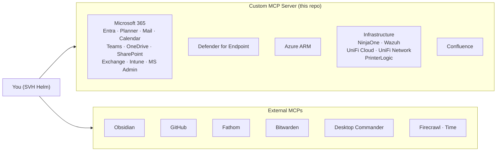
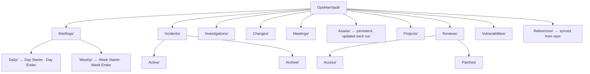

# SVH Helm

A purpose-built command station for SVH IT operations. Every system connected — Microsoft 365, Entra ID, Defender for Endpoint, Azure, NinjaOne, Wazuh, UniFi, PrinterLogic, Confluence. Twenty-three pre-wired investigation workflows. A live status dashboard. Claude is the intelligence layer; you drive.

```
"Day starter."
"Is there anything unusual in Wazuh from last night?"
"Tell me everything about SVH-SQL01."
"Why can't users at Site B reach the file server?"
"Help me plan this month's patching."
"Prep me for my 2pm with the network vendor."
"Check if any Azure NSGs have internet-exposed ports."
```

---

## Architecture



**Obsidian is home base.** Briefings, incident notes, change records, meeting notes — everything Helm produces lands in Obsidian. Nothing goes to Teams, Mail, Planner, or Confluence without you explicitly asking.

**Human-initiated only.** Skills are prompt patterns you trigger. Nothing runs on a schedule. Claude synthesizes — you command.

**PowerShell module suite** lives in `powershell/`. Load with `. ./connect.ps1` from Windows Terminal. The modules cover write operations and on-prem checks — disabling accounts, isolating devices, rebooting servers, querying Hyper-V and MABS via PSRemoting. A **TUI** (`./run-tui.sh`) wraps all 237 module functions in a searchable terminal interface: browse by module, fill parameters in a form, preview the command, confirm before anything destructive runs, and save output to Obsidian or view it inline.

---

## Connected systems

> 🔒 = read-only

| System | Capability |
|--------|-----------|
| **Outlook Mail** | Search, read, send, draft — locked to your mailbox |
| **Outlook Calendar** | View events, check availability, find meeting times |
| **Teams** | Read messages, send messages, manage channels |
| **Microsoft Planner** | Plans, tasks, assignments, due dates (no deletion — complete at 100%) |
| **Microsoft To Do** | Task lists and checklist items |
| **OneDrive** | Browse, search, create folders, generate sharing links |
| **SharePoint** 🔒 | Sites, lists, pages, permissions |
| **Exchange Admin** 🔒 | Mailbox settings, domains, distribution groups, message trace |
| **Entra ID** | Users, MFA, app registrations, roles, CA policies, sign-in/audit logs, dismiss risky users |
| **Intune** 🔒 | Device compliance, configuration profiles, deployed apps |
| **MS Admin** 🔒 | Service health, active incidents, Message Center, license subscriptions |
| **Defender for Endpoint** 🔒 | Devices, alerts, incidents, software inventory, CVEs, TVM recommendations |
| **Azure** 🔒 | Resource groups, VMs, storage, VNets, NSGs, activity logs, costs, Advisor |
| **NinjaOne RMM** 🔒 | Servers and workstations — services, patches, event logs, backups, alerts |
| **Wazuh SIEM** 🔒 | Alerts, agent inventory, FIM events, vulnerability detections, rootcheck |
| **UniFi Cloud** 🔒 | Sites and devices across all locations |
| **UniFi Network** 🔒 | VLANs, WLANs, firewall rules, switch ports, connected clients |
| **PrinterLogic** 🔒 | Printers, drivers, deployment profiles, audit logs, print quotas |
| **Confluence** | Search, read, edit pages, manage comments |
| **Obsidian** | Read and write notes — home base for all output |
| **Fathom** | Meeting transcripts and summaries |
| **GitHub** | Repos, issues, PRs, Actions workflows |
| **Firecrawl** | Web search, fetch URLs as Markdown |
| **Desktop Commander** | Run shell commands on the MCP host |
| **Bitwarden** 🔒 | Retrieve credentials; also loads MCP server credentials at startup |
| **Time** | Current time, timezone conversions, date arithmetic |

> One Graph app registration covers all Microsoft services except Defender and Azure — those each need their own. Mail and calendar tools are locked to `GRAPH_USER_ID` and cannot access any other mailbox.

---

## Skills

Trigger by slash command or by saying any of the listed phrases. Skills load on demand from `.claude/skills/` — no context cost until used. All output goes to Obsidian; nothing is sent anywhere without you explicitly asking.

### Daily rhythm

| Skill | Invoke | What it does | Output |
|-------|--------|-------------|--------|
| **Day Starter** | `/day-starter` · "Day starter" · "Morning briefing" | Last 24h (72h on Mondays). All monitoring sources + task stack → prioritized digest with suggested Planner updates staged for review. | `Briefings/Daily/YYYY-MM-DD.md` |
| **Day Ender** | `/day-ender` · "Day ender" · "End of day" | Last 12h. What got done, what's open, carry-forward for tomorrow. | Appended to today's note |
| **Week Starter** | `/week-starter` · "Week starter" · "What does the week look like" | Last week's loose ends + this week's load, calendar, open tasks, suggested first move. | `Briefings/Weekly/YYYY-WW.md` |
| **Week Ender** | `/week-ender` · "Week ender" · "Wrap up the week" | What shipped, what slipped, seeds for next week, optional team summary draft. | Obsidian + Confluence draft |

---

### When things go wrong

| Skill | Invoke | What it does |
|-------|--------|-------------|
| **Troubleshoot** | `/troubleshoot` · "X is broken" · "Troubleshoot Y" | Systematic isolation — expected vs. actual, one user or many, ranked hypotheses, cheapest-first. References SVH failure patterns for Hyper-V, MABS, CMiC, UniFi, WSUS. |
| **Event Log Triage** | `/event-log-triage` · "Check event logs on X" · "What happened on Z around [time]" | Wazuh first for correlation, NinjaOne for gaps, Desktop Commander for PowerShell deep-dives. |
| **Event Log Analyzer** | `/event-log-analyzer` · "Analyze this event log" · "Look at the log export from X" | For exported log files (`.xml`, `.csv`, `.txt`, `.log`) rather than live queries. |
| **Network Troubleshooter** | `/network-troubleshooter` · "Network issue at [site]" · "Why can't [users] reach [resource]" | UniFi Cloud → UniFi Network (VLANs, firewall, switch ports) → Wazuh (IDS events) → NinjaOne → Desktop Commander. |
| **Mailflow Investigation** | `/mailflow-investigation` · "Did this email deliver" · "Why didn't X get my message" | Exchange message trace → Defender (attachment/URL flags) → Entra → diagnostic timeline with root cause. |
| **Tenant Forensics** | `/tenant-forensics` · "Who touched it" · "What changed before X broke" · "Forensic audit" | Azure Activity Logs + Entra Audit Logs + NinjaOne event logs merged into a single actor-grouped timeline. Flags RBAC changes, MFA resets, app consent grants, NSG edits, policy changes. Output: `Investigations/YYYY-MM-DD-tenant-forensics-HHmm.md` |
| **IR Triage** | `/ir-triage` · alert investigation · "Is this suspicious" | **Currently disabled** (`SKILL.md.disabled`). The only skill that can send non-draft Teams messages — kept off until needed. Runs a triage gate (Burning Building / Active Investigation / Background) and enriches IOCs. |

---

### Posture & review

| Skill | Invoke | What it does | Output |
|-------|--------|-------------|--------|
| **Security Posture** | `/posture-check` · "Posture check" · "State of the land" | Green/Yellow/Red across Identity, Endpoints, Patching, Infrastructure, SIEM, and Cloud. | Obsidian snapshot |
| **Vuln Triage** | `/vuln-triage` · CVE ID · Defender TVM finding | CVE → exposed devices → patch state → timeline: Emergency / This Week / Next Cycle / Accept. | Obsidian note + Confluence draft + Planner tickets |
| **Asset Investigation** | `/asset-investigation` · "Tell me everything about [server/user]" | Servers/workstations: NinjaOne + Wazuh + Defender + Azure. Users: Entra sign-in history, MFA, roles, groups, CA policies. | `Assets/[name].md` (persistent, updated each run) |
| **Access Review** | `/access-review` · "Access review for [user/group/role]" | Roles, groups, app registrations, sign-ins, MFA, CA policies. Flags inactive privileged accounts, missing MFA, stale memberships. | Obsidian report + optional Confluence draft |
| **License Audit** | `/license-audit` · "License audit" · "License waste" | M365 licenses × Intune enrollment × MFA registration → Exposed (no device, no MFA), Ghost (inactive 30d+), Gaps. Monthly waste estimate. | `Reviews/Access/license-audit-YYYY-MM-DD.md` |

---

### Planning & coordination

| Skill | Invoke | What it does | Output |
|-------|--------|-------------|--------|
| **Patch Campaign** | `/patch-campaign` · "What needs patching" · "Plan patching" | NinjaOne pending patches → Defender TVM priority → tiers (Emergency / This Week / Next Cycle / Accept) → Planner board. | Obsidian note + Planner board |
| **Change Record** | `/change-record` · "Document this rollout" · "Change record for X" | Scope, risk, test plan, rollback, comms, schedule. Everything staged for review. | `Changes/` + Confluence draft + Planner card |
| **Project Creator** | `/project-creator` · "Turn this into a project" | Scope, deliverables, WBS, dependencies, effort estimate. Small (≤8 items): single Planner card. Large: full Planner plan + Confluence page. | `Projects/` |
| **Meeting Prep** | `/meeting-prep` · "Prep me for [meeting]" · "Pull notes from my [call]" | Before: calendar event + Fathom history + Confluence/Obsidian context + open tasks → brief + agenda template. After: Fathom transcript → structured note with decisions and suggested action items. | `Meetings/YYYY-MM-DD-name.md` |

---

### Content & documentation

| Skill | Invoke | What it does |
|-------|--------|-------------|
| **Draft** | `/draft` · "Draft an email" · "Write a message to" | Takes rough notes or bullet points, drafts an email or Teams message in Aaron's voice. Nothing sent — lands in `Drafts/` in Obsidian. |
| **TicketSmith** | `/ticketsmith` · "Write a ticket for this" · "Clean up this complaint" | Raw user complaint → professional IT ticket: title, problem, impact, steps to reproduce, suggested priority. Accepts pasted text, `.txt`, `.pdf`. |
| **Scribe** | `/scribe` · "Write this up" · "Document what I did" | Rough technician notes → structured documentation. Styles: standard, concise, detailed, incident-report, how-to. Optionally promotes to Confluence. |

---

## Obsidian vault



Every note opens with frontmatter:

```yaml
---
date: 2026-05-16
skill: Day Starter
status: draft
tags: [briefing, daily]
---
```

Status lifecycle: `draft` → `reviewed` → `filed` or `promoted`

Incident notes add `incident_id`, `severity`, `status`. Change notes add `change_id`, `risk`, `window`. Vuln notes add `cve`, `priority`.

---

## Setup

### Requirements

The server runs in **WSL 2 (Ubuntu 22.04)** on your workstation. It's a lightweight Node.js process (stdio transport) — no inbound ports, no scheduler.

- **Node.js** 18+
- **Bitwarden CLI** (`bw`) — unlock before every session
- Outbound HTTPS to: `graph.microsoft.com`, `login.microsoftonline.com`, `management.azure.com`, `api.securitycenter.microsoft.com`, `app.ninjarmm.com`, your UniFi controller, your Wazuh manager, `vault.bitwarden.com`

---

### 1. Install Claude Code (native binary)

```bash
claude install stable
echo 'export PATH="$HOME/.local/bin:$PATH"' >> ~/.bashrc && source ~/.bashrc
which claude   # → ~/.local/bin/claude
```

---

### 2. WSL shell environment

```bash
echo '[ -f ~/SVH-OpsMan/dotfiles/bashrc.sh ] && . ~/SVH-OpsMan/dotfiles/bashrc.sh' >> ~/.bashrc
source ~/.bashrc
```

This adds: BW unlock warning on new shells · `bwu` alias · `ops` alias · git branch in prompt · 10k-line history · `wexp` / `clip` / `wpath` helpers · git shorthand aliases · `opsman` / `wez-sync` / `wez-stop` for WezTerm.

---

### 3. Project config (automatic)

The `.claude/` directory is checked into this repo. Opening the project in Claude Code automatically loads:
- **Permissions** — common git and npm operations pre-approved
- **SessionStart hook** — injects branch, dirty-file count, and Bitwarden status
- **23 skills** in `.claude/skills/` — load on demand, zero context cost until triggered (IR Triage present but disabled)
- **Rules** — `typescript.md` (path-scoped to `mcp-server/src/**`) and `obsidian-output.md` (always loaded)

`.claude/settings.local.json` is gitignored — use it for personal overrides.

---

### 4. Build the server

```bash
cd mcp-server
npm install
npm run build
```

---

### 5. Credentials

All credentials are stored as custom fields on a single Bitwarden vault item named **SVH OpsMan**. Field names must match env var keys exactly.

```bash
export BW_SESSION=$(bw unlock --raw)   # unlock vault before starting
```

Verify startup:
```
[svh-opsman] Loaded 20 credential(s) from Bitwarden vault
[svh-opsman] Starting — 9/9 service groups configured
[svh-opsman] Ready — listening on stdio
```

---

### 6. Register MCPs with Claude Code

```bash
# Custom server
claude mcp add svh-opsman -- node ~/SVH-OpsMan/mcp-server/dist/index.js

# External MCPs
claude mcp add obsidian -e OBSIDIAN_API_KEY=xxx \
  -- npx -y mcp-obsidian http://127.0.0.1:27123
  # Enable "Local REST API" plugin in Obsidian first; grab key from plugin settings

claude mcp add github -e GITHUB_PERSONAL_ACCESS_TOKEN=ghp_xxx \
  -- npx -y @modelcontextprotocol/server-github

claude mcp add fathom -e FATHOM_API_KEY=xxx \
  -- npx -y fathom-mcp

claude mcp add firecrawl -e FIRECRAWL_API_KEY=xxx \
  -- npx -y @mendableai/firecrawl-mcp-server

claude mcp add desktop-commander \
  -- npx -y @wonderwhy-er/desktop-commander

claude mcp add bitwarden \
  -- npx -y @bitwarden/mcp

claude mcp add time \
  -- npx -y @modelcontextprotocol/server-time

```

---

## Credential reference

### Microsoft Graph — one app registration

Covers: Planner, To Do, Entra ID, OneDrive, SharePoint, Teams, Mail, Calendar, Exchange Admin, Intune, MS Admin.

Required **Application permissions** under Microsoft Graph (grant admin consent):

| Permission | Service |
|-----------|---------|
| `Tasks.ReadWrite` | Planner |
| `Tasks.ReadWrite.All` | To Do |
| `Group.Read.All` | Planner, Teams |
| `ChannelMessage.Send` | Teams |
| `TeamMember.ReadWrite.All` | Teams |
| `Files.ReadWrite.All` | OneDrive |
| `Sites.Read.All` | SharePoint |
| `Mail.ReadWrite` · `Mail.Send` | Outlook Mail |
| `Calendars.ReadWrite` | Outlook Calendar |
| `MailboxSettings.ReadWrite` | Calendar, Exchange Admin |
| `Place.Read.All` | Calendar rooms |
| `Policy.Read.All` · `Application.Read.All` | Entra ID |
| `RoleManagement.Read.Directory` | Entra ID |
| `IdentityRiskyUser.ReadWrite.All` | Entra ID (P2 required) |
| `UserAuthenticationMethod.Read.All` | Entra ID |
| `AuditLog.Read.All` | Entra ID sign-in/audit logs |
| `DeviceManagementManagedDevices.Read.All` | Intune |
| `DeviceManagementConfiguration.Read.All` | Intune |
| `DeviceManagementApps.Read.All` | Intune |
| `ServiceHealth.Read.All` | MS Admin |
| `Organization.Read.All` | MS Admin |
| `Directory.Read.All` | General |
| `Reports.Read.All` | Exchange Admin message trace |

**Bitwarden fields:** `GRAPH_TENANT_ID` · `GRAPH_CLIENT_ID` · `GRAPH_CLIENT_SECRET` · `GRAPH_USER_ID`

#### Restrict mail access to your mailbox only

`Mail.ReadWrite` is a tenant-wide application permission. The server locks all calls to `GRAPH_USER_ID`, but enforce it at Exchange too:

```powershell
# Run from Windows Terminal as ma_ admin account
New-DistributionGroup -Name "Claude OpsMan Mailbox Access" -Alias "claude-opsman-mailbox" -Type Security
Add-DistributionGroupMember -Identity "claude-opsman-mailbox" -Member "astevens@shoestringvalley.com"
New-ApplicationAccessPolicy -AppId "<GRAPH_CLIENT_ID>" `
  -PolicyScopeGroupId "claude-opsman-mailbox" -AccessRight RestrictAccess `
  -Description "Limit Claude OpsMan mail access to astevens only"

# Verify
Test-ApplicationAccessPolicy -AppId "<GRAPH_CLIENT_ID>" -Identity "astevens@shoestringvalley.com"  # → Granted
Test-ApplicationAccessPolicy -AppId "<GRAPH_CLIENT_ID>" -Identity "bbates@shoestringvalley.com"   # → Denied
```

> `Calendars.ReadWrite` cannot be restricted by `ApplicationAccessPolicy` — code-level `GRAPH_USER_ID` scoping is the only available control.

---

### Defender for Endpoint — separate app registration

In Entra ID → APIs my organization uses → **WindowsDefenderATP** → Application:

`Machine.Read.All` · `Alert.Read.All` · `Ti.Read` · `Vulnerability.Read.All` · `Software.Read.All` · `AdvancedQuery.Read.All`

**Bitwarden fields:** `MDE_TENANT_ID` · `MDE_CLIENT_ID` · `MDE_CLIENT_SECRET`

---

### Azure Resource Manager — service principal

```bash
az ad sp create-for-rbac --name "Claude OpsMan ARM" --role Reader --scopes /subscriptions/<id>
az role assignment create --assignee <client-id> --role "Cost Management Reader" --scope /subscriptions/<id>
```

**Bitwarden fields:** `AZURE_TENANT_ID` · `AZURE_CLIENT_ID` · `AZURE_CLIENT_SECRET` · `AZURE_SUBSCRIPTION_ID`

---

### Other services

| Service | Where to get credentials | Bitwarden fields |
|---------|--------------------------|-----------------|
| **UniFi Cloud** | account.ui.com → API Keys | `UNIFI_API_KEY` |
| **UniFi Network** | Local admin on UDM Pro / CloudKey | `UNIFI_CONTROLLER_URL` · `UNIFI_USERNAME` · `UNIFI_PASSWORD` |
| **NinjaOne** | Administration → Apps → API → Client Credentials | `NINJA_CLIENT_ID` · `NINJA_CLIENT_SECRET` |
| **Confluence** | id.atlassian.com → Security → API tokens | `CONFLUENCE_DOMAIN` · `CONFLUENCE_EMAIL` · `CONFLUENCE_API_TOKEN` |
| **Wazuh** | Wazuh manager API user | `WAZUH_URL` · `WAZUH_USERNAME` · `WAZUH_PASSWORD` |
| **PrinterLogic** | PrinterLogic admin console → API token | `PRINTERLOGIC_URL` · `PRINTERLOGIC_API_TOKEN` |

---

## PowerShell modules

Load from Windows Terminal with `. ./connect.ps1`. Credentials from Bitwarden (`bw unlock`) or `powershell/.env`.

| Module | Coverage |
|--------|---------|
| `SVH.Core` | Token cache, REST wrapper, credential accessor, domain constants, tier usernames |
| `SVH.Entra` | User/group/device lifecycle, MFA gap, license waste, stale devices, risky users, TAPs |
| `SVH.M365` | Teams, Mail, Calendar, Planner, To Do, OneDrive, SharePoint |
| `SVH.Exchange` | Mailbox settings, forwarding, litigation hold, message trace, service health |
| `SVH.Azure` | ARM + Defender MDE + Recovery Services — VMs, storage, NSGs, backup jobs (MABS), MDE isolation/scan |
| `SVH.NinjaOne` | Device discovery, services, disk, patches, backups, event logs, fleet-wide alert and offline summaries |
| `SVH.Wazuh` | Alerts, agents, FIM, vulnerabilities, auth failure detection |
| `SVH.UniFi` | Sites, devices, clients, WLANs, firewall rules, AP health, rogue client detection |
| `SVH.Confluence` | Pages, search, comments |
| `SVH.PrinterLogic` | Printers, drivers, deployment, quotas, audit log |
| `SVH.OnPrem` | PSRemoting — disk, services, pending reboot, Hyper-V VMs, cluster state, MABS job log, SQL memory config |
| `SVH.Cross` | Cross-system composites — user/asset summaries, patch surface, backup health, compliance gap, IR lockdown |

### Credential tiers

| Tier | Account | Auth | PSCredential |
|------|---------|------|-------------|
| `standard` | `astevens@shoestringvalley.com` | Passkey (BW) | ✗ — interactive browser |
| `server` | `sa_stevens@andersen-cost.com` | Password | ✓ — PSRemoting, Kerberos |
| `m365` | `ma_stevens@shoestringvalley.com` | Passkey (BW) | ✗ — interactive browser |
| `app` | `aa_stevens@shoestringvalley.com` | Passkey (BW) | ✗ — interactive browser |
| `domain` | `ACCO\da_stevens` | Password | ✓ — AD domain operations |
| `ra` | `ra_stevens@andersen-cost.com` | Password (BW: `DC_REMOTE_PASSWORD`) | ✓ — Desktop Commander read-only PSRemoting |

Use `Get-SVHTierUsername -Tier <tier>` to retrieve the correct account name for any tier. The `ra` account is created by `powershell/setup-dc-remote-account.ps1` — see `powershell/README.md` for details.

---

## Reference documents

`references/` — supporting content skills use at runtime. Copy to `Obsidian/References/` so the Obsidian MCP can serve them in any session. The repo versions are the source of truth.

| File | Used by |
|------|---------|
| `triage-gate.md` | IR Triage — lane classification and escalation path |
| `common-failure-modes.md` | Troubleshooting — SVH-specific failure patterns (Hyper-V, MABS, CMiC, UniFi, WSUS, PrinterLogic) |
| `hypothesis-patterns.md` | Troubleshooting — isolation moves by problem class |
| `common-event-clusters.md` | Event Log Triage — Wazuh/Windows event signatures by scenario |
| `ps-remoting-snippets.md` | Event Log Triage — Get-WinEvent recipes for common scenarios |
| `setup-winrm.md` | Event Log Triage — one-time WinRM trust setup from WSL to Windows targets |
| `credentials.md` | Credential reference — what's in Bitwarden vs. still missing |
| `users.md` | Team directory — Entra object IDs and UPNs for IT staff |

---

---

## WezTerm environment

WezTerm replaces Windows Terminal as the ops workspace. Files live in `dotfiles/`.

### Screen layout

```
┌──────────────────┬─────────────────────────┐
│                  │  [Claude][pwsh][bash][+] │
│    Obsidian      │                          │
│    ~40%          │       WezTerm            │
│    (sidebar      │       ~60%               │
│     collapsed)   │                          │
│                  ├─────────────────────────┤
│                  │ status bar               │
└──────────────────┴─────────────────────────┘
```

Tabs are colour-coded: **blue** = Claude Code, **yellow** = PowerShell, **green** = WSL bash.

### Status bar

```
BW ✓ · Wazuh 3 · MDE 1 · Risky 0 · Ninja 34/35 · M365 ✓ · UniFi ✓ · main* · 2m ago
```

Refreshes every 2 minutes. BW and git check locally; Wazuh/MDE/Entra/NinjaOne/M365/UniFi are fetched by `status-refresh.sh` running in the background. Shows `⚠ stale` if the refresh script isn't running or BW is locked.

### Files

| File | Purpose |
|------|---------|
| `dotfiles/wezterm.lua` | Main WezTerm config — symlinked to `%USERPROFILE%\.config\wezterm\wezterm.lua` |
| `dotfiles/install-windows.ps1` | Windows-side one-time setup: WezTerm (winget), Cascadia Code NF font, config symlink |
| `dotfiles/status-refresh.sh` | Background daemon — polls APIs every 120s, writes `/tmp/svh-opsman-status.json` |
| `dotfiles/bashrc.sh` | WSL shell environment — includes `opsman`, `wez-sync`, `wez-stop` |

### Setup

**Windows (once):**
```powershell
# From Windows Terminal — installs WezTerm, font, creates config symlink
.\dotfiles\install-windows.ps1
```

**WSL (once — included in `setup.sh`):**
```bash
# Copies wezterm.lua to Windows config path, marks status-refresh.sh executable
bash setup.sh
```

**Daily launch:**
```bash
opsman   # checks BW, starts status refresh daemon, opens WezTerm with Claude Code
```

### Keybindings

Leader key: **CTRL+\\**

| Chord | Action |
|-------|--------|
| `LEADER+d` | `/day-starter` |
| `LEADER+e` | `/day-ender` |
| `LEADER+w` | `/week-starter` |
| `LEADER+p` | `/posture-check` |
| `LEADER+t` | `/troubleshoot` |
| `LEADER+n` | `/network-troubleshooter` |
| `LEADER+c` | `/change-record` |
| `LEADER+v` | `/vuln-triage` |
| `LEADER+a` | `/asset-investigation` |
| `LEADER+x` | `/patch-campaign` |
| `LEADER+C` | New Claude tab |
| `LEADER+P` | New PowerShell tab |
| `LEADER+B` | New bash tab |
| `LEADER+r` | Rename current tab |
| `LEADER+2` | 2-pane horizontal split |
| `LEADER+3` | 3-pane horizontal split |
| `LEADER+h/j/k/l` | Navigate between split panes |
| `LEADER+o` | Quick-select `obsidian://` URIs from scrollback and open in Obsidian |
| `LEADER+u` | Force status bar refresh (bypasses 120s TTL) |

### obsidian:// deep links

Skills print their output note path as an `obsidian://` URI. WezTerm detects it as a hyperlink — click to open. Or use `LEADER+o` to quick-select any URI in the scrollback and open it.

---

## Roadmap & design notes

`roadmap.md` tracks the evolution plan, open design issues, architectural decisions, and known runtime quirks. Review it before adding new tools or refactoring high-frequency paths.
