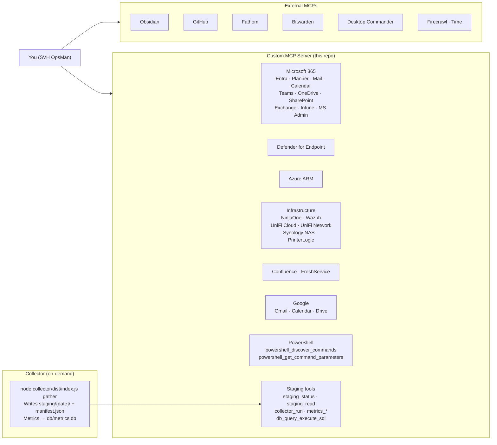

# Architecture

This document describes the architecture of the SVH OpsMan project, its core components, and the design decisions behind them.

## System Overview

## Technology Stack

The system is built on five key layers:

1.  **Claude (The AI):** The reasoning engine from Anthropic. It interprets user prompts, selects the appropriate tools, and synthesizes responses. It runs via the **Claude Code CLI** in your terminal.
2.  **MCP (Model Context Protocol):** The plugin system that gives Claude access to external tools. This project *is* a custom MCP server (`mcp-server/`), which allows for fine-grained control over tool logic and credential management. It also utilizes several external MCPs for services like Obsidian, GitHub, and Bitwarden.
3.  **WSL 2 (The Environment):** All components run inside WSL 2 (Ubuntu 24.04) on your Windows machine. This provides a real Linux environment for the Node.js applications and CLI tools, while still allowing seamless interaction with native Windows applications like Obsidian.
4.  **Bitwarden (The Credential Store):** All API keys and secrets are stored securely in a single Bitwarden item. The MCP server reads these at startup via the `bw` CLI, ensuring no credentials ever touch the filesystem in plaintext.
5.  **Obsidian (The Output Layer):** A local-first markdown editor that serves as the "staging area" for all AI output. Reports, drafts, and notes are written here for review before being actioned. The **Obsidian Local REST API** plugin enables this interaction.

## Design Decisions

-   **Why Claude Code CLI?** It provides per-project MCP registration, shell-level hooks (used for injecting context), and a robust permission model, which are essential for an operational tool.
-   **Why a custom MCP server?** It allows for full control over tool logic, versioning, auditing, and secure credential handling from Bitwarden, which is not possible with standard plugins.
-   **Why Bitwarden over `.env`?** To prevent accidental credential exposure. Bitwarden provides a secure, stateful vault that the server accesses at runtime. The server will not start if the vault is locked.
-   **Why Obsidian as the output layer?** It provides a critical "human-in-the-loop" staging area, ensures data persistence and ownership (local vault), and works offline.
-   **Why WSL 2?** It provides the most stable and feature-rich environment for the Claude Code CLI and the associated Node.js ecosystem, while maintaining easy interop with Windows.
-   **Why both MCP tools and PowerShell modules?** The MCP tools are designed for the AI to use in a read-only fashion for investigation. The PowerShell modules are designed for the human operator to use for write operations and actions that require direct control and confirmation.
-   **Why a single Graph app registration?** It simplifies credential management. While the permission set is broad, access is restricted both in the application code (by locking calls to a specific user ID) and at the Exchange level via an `ApplicationAccessPolicy`.

## Data Flow

### Interactive Queries

For targeted queries (e.g., "Tell me about server X"), the flow is simple:
1.  You enter a prompt.
2.  Claude selects the appropriate tool from the `svh-opsman` MCP server (e.g., `ninjaone_get_device`).
3.  The MCP server calls the relevant API (e.g., NinjaOne).
4.  The result is returned to Claude, who synthesizes an answer for you.

### On-Demand Bulk Data Collection (Collector)

For broad queries that require large amounts of data (e.g., `/day-starter`), the **Collector** is used.

1.  A skill (like Day Starter) determines if the existing data in the `staging/` directory is fresh enough (e.g., < 2 hours old) by calling `staging_status`.
2.  If the data is stale, the skill calls `collector_run`.
3.  The collector (`collector/dist/index.js`) executes, running jobs to pull bulk data (e.g., all devices from NinjaOne, all alerts from Wazuh).
4.  The data is written to a new timestamped directory in `staging/`, along with a `manifest.json` file detailing the run.
5.  The skill then calls `staging_read` to get the fresh data and proceeds with the synthesis.

This two-phase approach ensures that interactive sessions are fast, while still providing access to fresh, comprehensive data when needed, without repeatedly hitting bulk API endpoints. The collector runs only when a skill or a human requests it.
